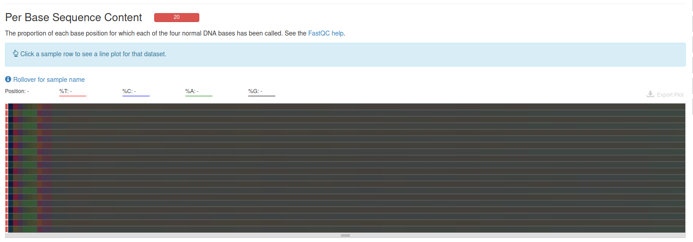
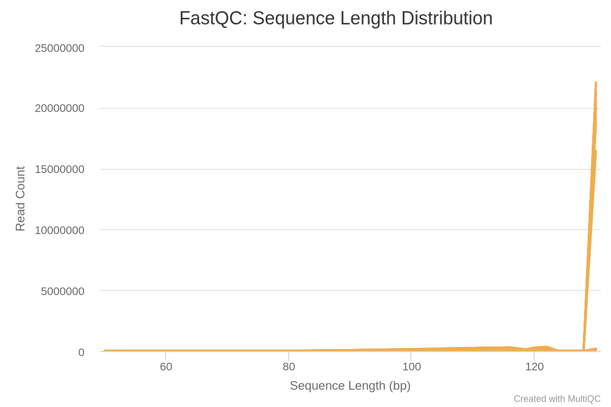

# Abstract

La electroacupuntura (EA) ha surgido como una posible estrategia no invasiva para mejorar la permeabilidad de la barrera hematoencefálica (BBB) y facilitar la administración de fármacos al sistema nervioso central (SNC). Sin embargo, los mecanismos moleculares subyacentes a esta respuesta aún no se comprenden completamente. En ese estudio, se llevó a cabo un análisis bioinformático de los datos de secuenciación de ARN (RNA-Seq) de un experimento previo que evaluó los cambios en la expresión génica en la corteza cerebral de ratas sometidas a EA. 

Nosotros como equipo realizamos un análisis bioinformático que incluirá el control de calidad de las secuencias crudas, la curación de los datos utilizando Trimmomatic, el alineamiento de las secuencias limpias con Kallisto, el análisis diferencial de expresión génica utilizando DESeq2 y el análisis funcional para determinar el enriquecimiento de genes en funciones biológicas específicas. De tal manera que podamos obtener resultados de genes significativamente diferencialmente expresados en el grupo de EA en comparación con el grupo de control.

# Introducción

La administración de fármacos al sistema nervioso central (SNC) representa un desafío debido a la presencia de la barrera hematoencefálica (BBB), la cual limita el paso de moléculas terapéuticas desde la circulación sistémica al cerebro. En los últimos años, se ha investigado el uso de la electroacupuntura (EA) como una estrategia no invasiva para mejorar la permeabilidad de la BBB y facilitar la entrega de fármacos al cerebro. Sin embargo, los mecanismos moleculares subyacentes a esta respuesta no se comprenden completamente.

El artículo previo utilizó la secuenciación de ARN (RNA-Seq) y análisis bioinformáticos para identificar los genes diferencialmente expresados en la corteza cerebral de ratas sometidas a EA en comparación con el grupo de control. Estos genes podrían desempeñar un papel crucial en la modulación de la permeabilidad de la BBB y, por lo tanto, son candidatos prometedores para futuras investigaciones y terapias.

Nuestro enfoque de análisis bioinformático comprenderá varias etapas, que incluyen el análisis de calidad de las secuencias crudas, la limpieza de adaptadores, el alineamiento de las secuencias limpias, el análisis diferencial de expresión génica y el análisis funcional para determinar el enriquecimiento de genes en funciones biológicas específicas. Estos pasos nos permitirán comparar nuestros resultados con los resultados del artículo en donde observaron los cambios en la expresión génica inducidos por la EA y su relevancia en la permeabilidad de la BBB.

# Métodos

## Descargar los SRA

```{bash, eval = FALSE}
# generar una carpeta en el cluster para trabajar
mkdir RNASeq
# crear un carpeta para descagar los SRA
mkdir data
# crear txt con los SRA  a descargar
nano mice_fastq.txt
# crear el job de descargar de los SRA
nano SRAData_dow.sge
# mandar el job a descargar
qsub SRAData_dow.sge
# observar el estado del job
qstat
```

Contenido de mice_fastq.txt

```{bash, eval = FALSE}
SRR17400880
SRR17400881
SRR17400882
SRR17400887
SRR17400883
SRR17400886
SRR17400884
SRR17400885
SRR17400888
SRR17400889
```

Contenido del job: 

```{bash, eval = FALSE}
#!/bin/bash
#
# Use Current working directory
#$ -cwd
#
# Join stdout and stderr
#$ -j n
#
# Run job through bash shell
#$ -S /bin/bash
#
# You can edit the script since this line
#
# Your job name
#$ -N SRAData_dow
#
# Send an email after the job has finished
#$ -m e
#$ -M jessgarrrcia@gmail.com
#
#
# If modules are needed, source modules environment (Do not delete the next line):
. /etc/profile.d/modules.sh
#
# Add any modules you might require:
module load sra/3.0.0
#
# Write your commands in the next line

# Descarga de datos

# PARTE 1.- Descargar SRA
prefetch --option-file ./mice_fastq.txt -O ./data

# --option-file : archivo de entrada con cada SRA por renglon
# -O : salida

# PARTE 2.- Cambio de SRA a Fastq
fastq-dump --gzip --skip-technical --dumpbase --split-3 --clip --outdir ./data/ ./data/SRR*/*.sra

# --gzip : Descomprimir archivos comprimidos con .gz
# --skip-technical : Optener solo lecturas de cada replica biologica. No tecnicas.
# --dumpbase : Formato de las secuencias basada en espacios.
# --split-3 : Separar archivos dependiendo del SRA en single-end con *.fastq, si es paired-end con *_1.fastq y *_2.fastq
# --clip : Remover adaptadores de las lecturas
# --outdir : salida
```

## Análisis de calidad de secuencias (FastQC y multiQC) de los datos crudos

Crearemos una carpeta llamada FastQC_rawData en donde vamos a tener el análisis de calidad de los datos crudos.

```{bash, eval = FALSE}
# directorio de trabajo
cd /mnt/Timina/bioinfoII/jgarcia/RNASeq
# crear carpeta
mkdir FastQC_rawData
```

Posteriormente, vamos a iniciar el análisis de calidad de las lecturas crudas o sin procesar (raw data)

```{bash, eval = FALSE}
# cargar module FastQC
module load fastqc/0.11.3

# Crear fastqc por lectura
fastqc ./data/*.fastq.gz -o ./FastQC_rawData
```

`fastqc ./data/*.fastq.gz -o ./FastQC_rawData` indica que realice un fastqc a todos los archivos contenidos en la carpeta data que terminen con .fastq.gz y que los outputs los ponga en la carpeta FastQC_rawData.

Ahora bien, se utiliza la herramienta MultiQC, la cual crea un único informe con gráficos interactivos para múltiples análisis bioinformáticos en muchas muestras. Se corre el siguiente código.

```{bash, eval = FALSE}
# Cargar modulo
module load multiqc/1.5
# Generar reporte multiqc
multiqc ./FastQC_rawData -o ./FastQC_rawData
```

Para poder visualizar el informe multiqc, se descarga el archivo a nuestro ordenador con el siguiente comando:

```{bash, eval = FALSE}
rsync -rptuvl jgarcia@dna.lavis.unam.mx:/mnt/Timina/bioinfoII/jgarcia/RNASeq/FastQC_rawData/multiqc_report.html .
```


En esta gráfica podemos observar que el valor medio de calidad en cada posición de base de la lectura es bastante bueno para cada una de las muestras.



Este heatmap nos muestra que la proporción de cada posición de base para la que se ha llamado a cada una de las cuatro bases normales del ADN en cada una de las muestras no pasó el filtro. Hay niveles demasiado bajos.


Esta imagen nos releva el contenido medio de GC de las lecturas y este se observa bastante bien para la mayoría de las muestras (17) para un par de ellas se ven comprometidas (3).


En esta imagen podemos observar que las 20 muestras se ven comprometidas en la distribución de tamaños de fragmentos (longitudes de lectura) encontrados.


En esta última imagen podemos observar el nivel relativo de duplicación encontrado para cada secuencia. Todas las muestras se encuentran en niveles extremedamente bajos.

Tras el análisis de calidad de secuencias crudas, optamos por curar los datos con Trimmomatic para mejorar los niveles bajos obtenidos en distintas gráficas. 

## Limpieza de adaptadores

Para la limpieza de adaptadores primeramente creamos una carpeta llamada data_trimmed en donde vamos a almacenar las secuencias limpias que, mediante un job llamado Trimmed_run.sge vamos a generar un análisis de datos y posteriormente reedirigirlo a una carpeta llamada FastQC_trimmed.

```{bash, eval = FALSE}
mkdir data_trimmed 
mkdir FastQC_trimmed
nano Trimmed_run.sge
```

Contenido del job Trimmed_run.sge

```{bash, eval = FALSE}
#!/bin/bash
#
# Use Current working directory
#$ -cwd
#
# Join stdout and stderr
#$ -j n
#
# Run job through bash shell
#$ -S /bin/bash
#
# You can edit the script since this line
#
# Your job name
#$ -N Trimmed_run
#
# Send an email after the job has finished
#$ -m e
#$ -M jessgarrrcia@gmail.com
#
#
# If modules are needed, source modules environment (Do not delete the next line):
. /etc/profile.d/modules.sh
#
# Add any modules you might require:
module load fastqc/0.11.3
module load multiqc/1.5
module load trimmomatic/0.33
# 
# PARTE 1.- FastQC y multiQC
fastqc ./data/*.fastq.gz -o ./FastQC_rawData
multiqc ./FastQC_rawData -o ./FastQC_rawData

# PARTE 2.- Limpieza de adaptadores
# paired-end
cd data
for i in *_1.fastq.gz;
do echo
trimmomatic PE -threads 8 -phred33 $i "${i%_1.fastq.gz}_2.fastq.gz" \
../data_trimmed/"${i%_1.fastq.gz}_1_trimmed.fastq.gz" ../data_trimmed/"${i%_1.fastq.gz}_1_unpaired.fastq.gz" \
../data_trimmed/"${i%_1.fastq.gz}_2_trimmed.fastq.gz" ../data_trimmed/"${i%_1.fastq.gz}_2_unpaired.fastq.gz" \
ILLUMINACLIP:../TruSeq3-PE.fa:2:30:10 LEADING:3 TRAILING:3 SLIDINGWINDOW:5:20 MINLEN:60
done

# PARTE 3.- FastQC y multiQC
cd ../
fastqc ./data_trimmed/*.fastq.gz -o ./FastQC_trimmed
# Reporte en MultiQC
multiqc ./FastQC_trimmed -o ./FastQC_trimmed
```

Trimmomatic es la herramienta de línea de comandos rápida que utilizamos para recortar y curar datos de Illumina (FASTQ), así como para eliminar adaptadores.

## Análisis de calidad de secuencias (FastQC y multiQC) de los datos limpios

Para analizar la calidad de secuencias descargamos el reporte multiqc a nuestro ordenador.

```{bash, eval = FALSE}
rsync -rptuvl jgarcia@dna.lavis.unam.mx:/mnt/Timina/bioinfoII/jgarcia/RNASeq/data/FastQC_trimmed/multiqc_report.html .
```


Este heatmap nos muestra que la proporción de cada posición de base para la que se ha llamado a cada una de las cuatro bases normales del ADN en cada una de las muestras mejoró bastante. Mucho más de la mitad de las muestras ahora pasa el filtro. Sin embargo, hay un par de muestras que aún muestras niveles deficientes.



En esta imagen podemos observar que aún con el uso de Trimmomatic las muestras siguen mostrando los mismos valores en la distribución de tamaños de fragmentos (longitudes de lectura) encontrados.


En esta última imagen podemos observar que el nivel relativo de duplicación encontrado para cada secuencia disminuyó en un par de muestras; posicionando a muchas de ellas en niveles adecuados y en niveles intermedios. Sin embargo, aún con la limpieza de datos, existen un par de muestras con niveles muy bajos.


El uso de Trimmomatic nos ayudó a reducir los datos en los que se presentaba algún tipo de problema de secuenciación. Todavía quedaron algunas muestras con algunas deficiencias, sin embargo, muchas de ellas se redujeron.

## Programa de predicción de cuentas (Kallisto)

Continuando con los pasos del pipeline, haremos uso de Kallisto quant el cual es una herramienta de pseudoalineamiento para datos de transcriptoma la cual se basa en la probabilidad de asignación correcta de las lecturas a un transcrito.

Para ello, creamos una nueva carpeta llamada `kallisto_quant_test` y un job llamado
`Kallisto_down_data.sge` que contiene las intrucciones para realizar el pseudoalineamiento con ayuda de un transcrito de referencia que obtuvimos con las siguientes líneas de código.

```{bash, eval = FALSE}
# Carpeta de archivos kallisto
mkdir kallisto_quant_test

# Para descargar transcriptoma de referencia realizamos lo siguiente:

# Generar transcriptoma de referencia mediante el JOB 'Transcript_down.sge', con las instrucciones:
wget https://ftp.ncbi.nlm.nih.gov/genomes/all/GCF/015/227/675/GCF_015227675.2_mRatBN7.2/GCF_015227675.2_mRatBN7.2_rna.fna.gz
# Creación del JOB para realizar el pseudoalineamiento
nano Kallisto_down_data.sge
```

Información que contiene el job
Kallisto_down_data.sge

```{bash, eval = FALSE}
#!/bin/bash
#
# Use Current working directory
#$ -cwd
#
# Join stdout and stderr
#$ -j n
#
# Run job through bash shell
#$ -S /bin/bash
#
# You can edit the script since this line
#
# Your job name
#$ -N Rat_kallisto
#
# Send an email after the job has finished
#$ -m e
#$ -M axelrdz5205@gmail.com
#
#
# If modules are needed, source modules environment (Do not delete the next line):
. /etc/profile.d/modules.sh
#
# Add any modules you might require:
module load kallisto/0.45.0
#
# Write your commands in the next line

# Dentro de /mnt/Timina/bioinfoII/rnaseq/BioProject_2023/rawData/Homo_sapiens/data_trimmed

# Generar index de kallisto
kallisto index ./GCF_015227675.2_mRatBN7.2_rna.fna.gz -i ../kallisto_quant_test/mRat_ref.kidx

# - i nombre del archivo de salida, i.e., indice
#- Input = GCF_015227675.2_mRatBN7.2_rna.fna.gz, transcriptoma de referencia

 # Paired-end  
for file in ./*_1_trimmed.fastq.gz                                                 # Read1
do
  clean=$(echo $file | sed 's/_trimmed//;s/\.fastq\.gz//;s/_1//')         # Nombre de la carpeta de salida, mismo nombre de SRA
  file_2=$(echo ${clean}_2_trimmed.fastq.gz| sed 's/FP/RP/')                                            # Read2
  kallisto quant --index ../kallisto_quant_test/mRat_ref.kidx --output-dir ../kallisto_quant_test/${clean} --threads 12 ${file} ${file_2}
done
```

Ahora bien, para asegurarnos que el pseudoalineamiento se realizó correctamente deberíamos tener los archivos tipo .h5, .tsv y json de cada muestra así que realizamos las siguientes líneas de código para verificar que efectivamente se encuentran esos archivos.

```{bash, eval = FALSE}
cd /mnt/Timina/bioinfoII/arodriguez/Repositorios/kallisto_quant_test
cd SRR18745762 #entrar a cada una de las muestras
ls
```

Observamos que en cada muestra hubo un buen alineamiento, así que procedemos a recuperar estos resultados descargando los datos a nuestro computador con la siguiente línea de comando

```{bash, eval = FALSE}
# Descagar resultados de kallisto
rsync -rptuvl jgarcia@dna.liigh.unam.mx:/mnt/Timina/bioinfoII/arodriguez/Repositorios/kallisto_quant_test/SRR* .
```

El siguiente paso que sigue el pipeline que estamos realizando es el análisis de expresión diferencial.

## Expresión diferencial

El objetivo del análisis de expresión diferencial es realizar análisis estadísticos para tratar de descubrir cambios en los niveles de expresión de características definidas (genes, transcripciones, exones) entre grupos experimentales con muestras replicadas.

### Instalaciones

Para realizar el análisis de expresión diferencial, se empleó el proyecto de R de Bioconductor, una plataforma que ofrece una variedad de paquetes y métodos diseñados específicamente para el análisis de datos omicos. 

Los paquetes utilizados fueron `tximport_1.28.0`, cuya función es importar y resumir datos a nivel de transcripción generados a partir de herramientas de cuantificación; `tidyverse_2.0.0`, para hacer más fácil y eficiente la manipulación, visualización y análisis de datos; `DESeq2_1.40.1`, para identificar genes que se expresan diferencialmente entre dos o más condiciones experimentales; `ggplot2_3.4.2`, para crear varios tipos de gráficos; `ggrepel_0.9.3`, para crear etiquetas de texto que se ajustan automáticamente; `rhdf5_2.44.0`, que permite una lectura, escritura, manipulación y gestión eficientes de conjuntos de datos complejos; `GenomicFeatures_1.52.0`, que permite a los usuarios importar, consultar, recuperar y visualizar características genómicas; `biomaRt_2.56.0`, para acceder, recuperar, integrar y analizar datos biológicos de varias bases de datos; `pheatmap_1.0.12`, para crear mapas de calor personalizables y visualmente atractivos; y `genefilter_1.82.1`, para filtrar y seleccionar genes según diversos criterios en el análisis de datos genómicos de alto rendimiento.

```{r Librerias, results='hide', message=FALSE}
library(tximport)
library(tidyverse)
library(DESeq2)
library(ggplot2)
library(ggrepel)
library(rhdf5)
```

### Importacion de datos de kallisto en R (*Import transcript-level estimates*)

```{r Intalacion GenomicFeatures, eval=FALSE, include=FALSE}
if (!require("BiocManager", quietly = TRUE))
    install.packages("BiocManager")

BiocManager::install("GenomicFeatures")
```

Primero, creamos un vector apuntando a los archivos de cuantificación (los `abundance.h5`). Leyendo una tabla que contiene su respectivo SRR, y luego combinándolo con `"."` y `"abundance.h5"`, el vector tendrá los nombres de los archivos. 

```{r Metadatos}
# > R norvegicus
# generar tabla de metadatos
Rn_metadata.tsv <- data.frame("SRA" =c("SRR17400880",  # EA 5
                                       "SRR17400881", # EA 4
                                       "SRR17400882", # EA 3
                                       "SRR17400887", # EA 2
                                       "SRR17400883", # EA 1
                                       "SRR17400886", "SRR17400884", "SRR17400885", "SRR17400888", "SRR17400889"),  # Controles
                              "sample" = c("EA_5","EA_4", "EA_3", "EA_2",  "EA_1", 
                                           "control_5", "control_4",  "control_3", "control_2", "control_1") , 
                              "dex" = c(rep("EA",5), 
                                        rep("control",5)), 
                              "species" = "Rattus norvegicus")
```

Entonces, generamos un código que carga metadatos desde un archivo, genera rutas de archivo para los archivos de abundancia, asigna nombres a las rutas y verifica si los archivos correspondientes existen.

```{r Samples and Files}
# Anotacion articulo
Rn_samples <- Rn_metadata.tsv
Rn_samples
Rn_files   <- file.path("./Kallisto_quant", Rn_samples$SRA,"abundance.h5") # Crear ruta a cada archivo abundance de cada SRA
names(Rn_files) <- Rn_samples$SRA # Nombrar las rutas con el nombre de su correspondiente SRA
all(file.exists(Rn_files))
```

La función `file.path` te permite crear una ruta a un archivo específico en un directorio de trabajo. En este caso, una ruta para cada archivo `abundance.tsv`.
Las transcripciones deben asociarse con identificadores genéticos (*gene IDs*) para el resumen a nivel genético (*gene-level summarization*). Si esa información está presente en los archivos, podemos omitir este paso. Para Salmon, Sailfish, y kallisto los archivos sólo proporcionan el ID de la transcripción. 

Primero hacemos un *data-frame* llamado `tx2gene` con dos columnas: 
  1) ID de la transcripción y 
  2) ID del gen. 
Los nombres de las columnas no importan, pero este orden de columnas debe ser utilizado. El ID de la transcripción debe ser el mismo utilizado en los archivos
`abundance.tsv`. 

```{r creacion archivo csv, eval=FALSE, echo=T}
library(GenomicFeatures)
txdb <- makeTxDbFromGFF(file="Rattus_norvegicus.mRatBN7.2.109.gtf.gz") # Archivo de anotación de la rata
saveDb(x=txdb, file = "Rattus_norvegicus.mRatBN7.2.109.gtf.TxDb")
k <- keys(txdb, keytype = "TXNAME")
tx2gene <- select(txdb, k, "GENEID", "TXNAME")
write.table(tx2gene, "tx2gene.ensembl.mRatBN7.csv", sep = "\t", row.names = FALSE)
```

Luego, leemos en una tabla `tx2gene` (pre-construida), la cual vincula las transcripciones a los genes para este conjunto de datos:

```{r tabla tx2gene Rn}
Rn_tx2gene   <- read.csv("tx2gene.ensembl.mRatBN7.csv", sep="\t",header=TRUE) 
head(Rn_tx2gene)
```

La función `read.csv` lee un archivo en formato tabla y crea un *data frame* a partir de el, con casos correspondientes a líneas y variables a campos del archivo.

Para la importación de los datos de cuantificación a nivel de transcripción necesarios para el análisis de expresión diferencial, se utilizó el paquete tximport. En este caso, el argumento type se utilizó para especificar que el software utilizado para la estimación fue kallisto. La función devuelve una lista con matrices que resumen la información del nivel de transcripción al nivel genético, incluyendo "abundance", "counts" y "length". La matriz `"length"` se puede utilizar para generar una matriz de desplazamiento para el análisis diferencial a nivel genético de matrices de conteo (*offset matrix for downstream gene-level differential analysis*), como se muestra abajo.

```{r tximport kallisto}
Rn_txi_kallisto <- tximport(Rn_files, type = "kallisto", tx2gene=Rn_tx2gene, ignoreAfterBar=TRUE, txOut = TRUE)
names(Rn_txi_kallisto)
head(Rn_txi_kallisto$counts)
```

Note que añadimos un argumento adicional en este fragmento de código, `ignoreAfterBar=TRUE`. Esto se debe a que las transcripciones del código genético tienen nombres como “NM_001000000. 1|NM_001000002. 1|. . . ”, aunque nuestra tabla tx2gene solo incluye el primer identificador “NM_”. Por lo tanto, queremos dividir los nombres de las filas de la matriz de cuantificación entrante en la primera barra “|”, y solo usar esto como identificador.

Se debe asegurar que los nombres de fila de la tabla `Rn_samples` se alineen con los nombres de columna de `Rn_txi_kallisto$counts`, si hay nombres de fila.

```{r Nombre transcriptomas}
# nombre de los transcriptomas
rownames(Rn_samples) <- Rn_samples$sample # Nombre de cada fila como nombre de la muestra
colnames(Rn_txi_kallisto$counts) <-rownames(Rn_samples) # Nombre de cada columna como nombre de cada muestra
head(rownames(Rn_samples))
head(colnames(Rn_txi_kallisto$counts))
```

Posteriormente, para construir un _DESeqDataSet_ (`Rn_ddsTxi_all`) -objeto utilizado para almacenar las _read counts_ y las cantidades intermedias estimadas (*intermediate estimated quantities*) durante el análisis estadístico- a partir del objeto `Rn_txi_kallisto` y mostrar información en muestras.

```{r Importacion de datos DESeqDataSetFromTximport, warning=FALSE}
# Importacion de los datos convirtiendolos en un objeto que puede leer Deseq.
Rn_ddsTxi_all <- DESeqDataSetFromTximport(Rn_txi_kallisto, Rn_samples, design = ~ dex) # Create a DESeq object from the tximport data
```

### Prefiltrado

Si bien no es necesario prefiltrar genes de bajo conteo antes de ejecutar las funciones DESeq2, hay dos razones que hacen útil el prefiltrado: 
1. al eliminar filas en las que hay muy pocas lecturas, reducimos el tamaño de la memoria del objeto de datos dds (`Rn_ddsTxi_all`), y aumentamos la velocidad de las funciones de transformación y _testing__ dentro de DESeq2. 
2. También puede mejorar las visualizaciones, ya que las características sin información para la expresión diferencial no se trazan.

Aquí realizamos un pre-filtrado mínimo para mantener sólo las filas que tienen al menos 10 lecturas en total.

```{r Prefiltrado, message=FALSE}
# Prefiltrado, eliminacion de genes con bajas cuentas
keep <- rowSums(counts(Rn_ddsTxi_all)) >= 10 # Si en una fila solo hay 10 cuentas (mapeo 10 veces)
Rn_ddsTxi_all <- Rn_ddsTxi_all[keep,] 
Rn_dds_all <- DESeq(Rn_ddsTxi_all) # run Differential expression analysis
```

Los pasos de análisis de expresión diferencial estándar están envueltos en una sola función, `DESeq`.

### Cuentas normalizadas para graficas (rlog)

Muchos métodos estadísticos comunes para el análisis exploratorio de datos multidimensionales, como el análisis de agrupación y componentes principales (PCA), funcionan mejor para datos que generalmente tienen el mismo rango de varianza en diferentes rangos de los valores de la media.

DESeq2 ofrece dos transformaciones para datos de conteo que estabilizan la varianza a través de la media: la __*transformación estabilizadora de varianza (VST)*__, y la transformación _regularizada de logaritmos_ o _rlog_.

En este caso, utilizaremos rlog. A pesar de que VST es mucho más rápido de computar y es menos sensible a los valores atípicos con conteos altos que el rlog, este último tiende a funcionar bien en conjuntos de datos pequeños ($n$ < 30).

```{r Normalizacion rlog}
Rn_all_normalized <- rlog(Rn_dds_all, blind=FALSE) # result rld, vst
Rn_all_normalized_db <- as.data.frame(assay(Rn_all_normalized))
head(Rn_all_normalized_db)
```

Tanto `vst` como `rlog` devuelven un objeto *DESeqTransform* basado en la clase *SummarizedExperiment*, es decir los valores transformados ya no son conteos.

En las llamadas a funciones anteriores, especificamos `blind = FALSE`, lo que significa que las diferencias entre las líneas celulares y el tratamiento (las variables en el diseño) no contribuirán a la tendencia esperada de varianza-media del experimento. 

### PCA

Un primer paso útil en un análisis de ARN-seq es a menudo evaluar la similitud general entre las muestras. Un gráfico PCA muestra las muestras en el plano 2D abarcadas por sus dos primeros componentes principales. Este tipo de gráfico es útil para visualizar el efecto general de las covariadas experimentales y los efectos _batch_.

En este proyecto, hemos utilizado la función `plotPCA` que viene con `DESeq2`. El término especificado por `intgroup` es el grupos de interés para etiquetar las muestras; le dicen a la función que debe usarlos para elegir colores.

### Expresion diferencial

Como se mencionó antes, los pasos de análisis de expresión diferencial estándar están envueltos en una sola función, `DESeq`. Las tablas de resultados se generaron utilizando la función `results()`, que extrajo una tabla de resultados con cambios de *log2 fold*, valores p y valores p ajustados. Los nombres de los genes y su identificación de Ensembl se obtuvieron mediante la función `getBM` del paquete `biomaRt`.

```{r Tabla resultados}
library(DESeq2)
library(biomaRt)

Rn_res_all <- results(Rn_dds_all)  # Save the results

# Adding gene names and Ensembl ID
ensembl <- useEnsembl(biomart = "ensembl", dataset = "rnorvegicus_gene_ensembl")

Rn_res_all$refseq_id <- sapply( strsplit( rownames(Rn_res_all), split="\\+" ), "[", 1 )  # Colectamos los IDs de refseq_mrna
Rn_res_all$refseq_id <- substr(Rn_res_all$refseq_id,1,nchar(Rn_res_all$refseq_id)-2)  # Sustraemos ultimos dos terminos de cada ID (representa la version, pero no nos interesa)

# Get the gene names from Ensembl using the 'getBM' function
gene_info <- getBM(attributes = c("refseq_mrna", "external_gene_name", "ensembl_gene_id"),
                   filters = "refseq_mrna", 
                   values = Rn_res_all$refseq_id,
                   mart = ensembl)

idx <- match( Rn_res_all$refseq_id, gene_info$refseq_mrna )
Rn_res_all$refseq_mrna <- gene_info$refseq_mrna[ idx ]
Rn_res_all$external_gene_name <- gene_info$external_gene_name[ idx ]
Rn_res_all$ensembl_gene_id <- gene_info$ensembl_gene_id[idx]

Rn_res_all
```

La columna `baseMean` fue una media de los valores normalizados de conteo, divididos por los factores de tamaño (*size factors*), tomada sobre todas las muestras del DESeqDataSet (`Rn_dds_all`). La columna `log2FoldChange` fue la estimación del tamaño del efecto (*effect size estimate*), la cual representa cuánto parece haber cambiado la expresión del gen debido al tratamiento con Electroacupunrura en comparación con las muestras control. La columna `lfcSE` fue la estimación de error estándar para la estimación del *log2 fold change*. La columna `pvalue` es el resultado de una prueba estadística que DESeq2 realiza para cada gen, en la que la hipótesis nula es que no hay efecto del tratamiento en el gen y que la diferencia observada entre el tratamiento y el control fue causada meramente por la variabilidad experimental (es decir, el tipo de variabilidad que se puede esperar entre diferentes muestras en el mismo grupo de tratamiento).

Ahora, para saber qué conjunto de genes están diferencialmente expresados (ya sea sobre o subexpresados), reducimos el umbral de `padj` a menor a 0.5 y pedimos que el log2 fold change sea mayor o igual a 0.5.

```{r UP and DOWN genes}
# extraer UP
Rn_all_de_gene_matrix_UP  <- subset(Rn_res_all, padj < 0.05 & log2FoldChange >= 0.5)
write.table(Rn_all_de_gene_matrix_UP,file ="./Rn_all_DEG_kallisto_JNK_inh.tsv", quote=FALSE, sep="\t")
# Extraer nombres
Rn_all_de_gene_names_UP <- rownames(Rn_all_de_gene_matrix_UP)

# extraer down genes
Rn_all_de_gene_matrix_DOWN  <- subset(Rn_res_all, padj < 0.05 & log2FoldChange < -0.5)
write.table(Rn_all_de_gene_matrix_DOWN,file ="./Rn_all_DEG_kallisto_Control.tsv", quote=FALSE, sep="\t")
# Extraer nombres
Rn_all_de_gene_names_DOWN <- rownames(Rn_all_de_gene_matrix_DOWN)
```

### Volcano plot

En este caso, para visualizar los datos normalizados podemos hacer uso de un _volcano plot_. De esta manera, podremos dar cuenta fácilmente de los genes que tienen un valor $p$ de mayor significacia. Para esto, se convirtieron los resultados en un data frame y se etiquetaron los genes según criterios de cambio de expresión. Se filtraron los genes de interés y se generó un gráfico de tipo "volcano plot" para visualizar los resultados. El código implementó la función ggplot2 para la creación del gráfico y utilizó diversas funciones de manipulación y asignación de valores en el data frame. Este enfoque permitió identificar y visualizar genes diferencialmente expresados, facilitando la interpretación y el análisis de los datos obtenidos.

```{r Volcano plot code, eval=FALSE}
# Volvemos los resultados en data frame
Rn_de <- as.data.frame(Rn_res_all)
# add a column of NAs
Rn_de$diffexpressed <- "NO"
# if log2Foldchange > 0.6 and pvalue < 0.05, set as "UP" 
Rn_de$diffexpressed[Rn_de$log2FoldChange > 0.5 & Rn_de$pvalue < 0.05] <- "UP"
# if log2Foldchange < -0.6 and pvalue < 0.05, set as "DOWN"
Rn_de$diffexpressed[Rn_de$log2FoldChange < -0.5 & Rn_de$pvalue < 0.05] <- "DOWN"
# Create a new column "names" to de, that will contain the name of a subset if genes differentially expressed (NA in case they are not)
Rn_de$names <- NA
# filter for a subset of interesting genes
filter <- which(Rn_de$diffexpressed != "NO" & Rn_de$padj < 0.05 & (Rn_de$log2FoldChange >= 5  | Rn_de$log2FoldChange <= -5))
Rn_de$names[filter] <- rownames(Rn_de)[filter]
# grafica
#png(file = "volcano05-res.png",
#    width = 800, height = 800) # guardar el plot en formato png
ggplot(data=Rn_de, aes(x=log2FoldChange, y=-log10(pvalue), col=diffexpressed, label=names)) +
    geom_point() +
    scale_color_manual(values=c("blue", "black", "red")) + # cambiar colores de puntos
    theme_minimal() +
    geom_text_repel() +
    xlim(-15,15)

```

### Heatmap 

Utilizamos un mapa de calor para visualizar la agrupación de genes que llevan una señal. En este caso, seleccionamos los 20 genes con la mayor varianza entre las muestras. Se seleccionaron los 20 genes con mayor varianza a partir de una matriz de datos normalizados. Posteriormente, se creó una submatriz con los genes seleccionados y se realizó una normalización adicional restando las medias de las filas. Se extrajeron las anotaciones de las muestras y se creó un data frame para su representación. Por último, se generó un mapa de calor utilizando la función pheatmap(), que permite visualizar los patrones de expresión génica. Este enfoque facilitó la identificación y visualización de genes relevantes en el conjunto de datos Rn_all, proporcionando información valiosa para el análisis y la interpretación de los resultados obtenidos. Esto se muestra en el siguiente código:

```{r instalacion genefilter, eval=FALSE, include=FALSE}
BiocManager::install("genefilter")
```

```{r heatmap code, message=FALSE, eval=FALSE}
library("genefilter")
library("pheatmap")
topVarGenes <- head(order(rowVars(assay(Rn_all_normalized)), decreasing = TRUE), 20)  # Seleccion de mayores genes
mat  <- assay(Rn_all_normalized)[ topVarGenes, ]  # Matriz con mayores genes
mat  <- mat - rowMeans(mat)
anno <- as.data.frame(colData(Rn_all_normalized)[, c("sample","dex")]) # Anotaciones
pheatmap(mat, annotation_col = anno) # Grafica
```

## Analisis funcional (terminos GO)

### Instalar `clusterProfiler`, `AnnotationDbi` y Base de Datos de Rata `Rattus.norvegicus`

Utilizamos la biblioteca `clusterProfiler` para explorar las anotaciones funcionales de un grupo de genes o proteínas. Esta biblioteca realiza análisis de enriquecimiento de Gene Ontology (GO) y análisis de vías, identificando términos de GO sobrerepresentados dentro de un grupo de genes y vías biológicas enriquecidas basadas en bases de datos de vías predefinidas, como KEGG o Reactome.

Además, utilizamos AnnotationDbi para realizar análisis genómicos de genes de interés. Para obtener las anotaciones del organismo *Rattus norvegicus*, instalamos la biblioteca org.Rn.eg.db en Bioconductor. Al utilizar esta base de datos, podemos acceder y asociar información específica de los genes de la rata en nuestros análisis de enriquecimiento. 

```{r instalaciones, eval=FALSE}

# Instalar Bioconductor version 3.17
if (!require("BiocManager", quietly = TRUE))
    install.packages("BiocManager")
BiocManager::install(version = "3.17")

# Instalar librerias necesarias para analisis de enriquecimiento
BiocManager::install("clusterProfiler")
BiocManager::install("AnnotationDbi")

# Instalar  anotaciones específicas de la especie Rattus norvegicus (rata)
BiocManager::install("Rattus.norvegicus") 
BiocManager::install("org.Rn.eg.db") 


# En algunos casos es necesario instalar la libreria  "libxml2", por lo que en bash es posible instalarla con el siguiente codigo:
wget ftp://xmlsoft.org/libxml2/libxml2-2.9.2.tar.gz

```

### Extraer informacion de BD

```{r Codigo, message=FALSE}

# Cargar environment
#load("~/Documents/env1 (1).RData")

#Importar librerias 
library(clusterProfiler) #Enrichment analysis
library (AnnotationDbi) # Anotaciones de las Bases de Datos
library(org.Rn.eg.db) # Genoma de Rata


# Tomar tabla de datos de DESEQ2
data = Rn_res_all

# Eliminar filas que no tienen valores 
data = na.omit(data)

# Tomar solo los genes posiblemente diferentemente expresados significativoas con un log2FoldChange>=0.5 y padj < 0.5
data = data[data$log2FoldChange >= 0.5, ]
data = data[data$padj < 0.05, ]

# Solo requerimos los IDs, por los que los guardamos en "genes_to_test"
genes_to_test = data$ensembl_gene_id

# Convertirlo en matriz y utilizar solo los primeros 10 IDs, ya que son un total de 3,257
genes_to_test = as.matrix(genes_to_test)
genes_to_test = genes_to_test[1:10,]

# Eliminar todo despues del "."
genes <- gsub("\\..*","",genes_to_test)
genes <- as.data.frame(genes)

# Analisis de enrequicimiento con los primeros 10 IDs, tomando como genoma el de la rata (org.Rn.eg.db)
Go_results <- enrichGO(gene = genes_to_test, OrgDb= "org.Rn.eg.db", keyType = "ENSEMBL", ont = "BP")
```

### Convertir en data frame

```{r Dataframe GO results}
# Convwertir en data-frame
as.data.frame(Go_results)
```

# Resultados 

## Análisis de expresión diferencial 

### PCA

```{r PCA}
plotPCA(Rn_all_normalized, intgroup=c("dex"))
```

En esta gráfica, lo que observamos es que las muestras control y las muestras tratadas con Electroacupuntura (EA) se agrupan en clústers distintos. 

### Expresión diferencial

```{r}
# Numero de genes expresados
length(Rn_all_de_gene_names_UP)
length(Rn_all_de_gene_names_DOWN)
```

Tras el filtrado mencionado en los métodos filtrado, encontramos que existen un total de 242 genes diferenciados, 107 genes sobreexpresados y 135 genes subexpresados.

### Volcano plot

```{r Volcano plot, warning=FALSE}
# Volvemos los resultados en data frame
Rn_de <- as.data.frame(Rn_res_all)
# add a column of NAs
Rn_de$diffexpressed <- "NO"
# if log2Foldchange > 0.6 and pvalue < 0.05, set as "UP" 
Rn_de$diffexpressed[Rn_de$log2FoldChange > 0.5 & Rn_de$pvalue < 0.05] <- "UP"
# if log2Foldchange < -0.6 and pvalue < 0.05, set as "DOWN"
Rn_de$diffexpressed[Rn_de$log2FoldChange < -0.5 & Rn_de$pvalue < 0.05] <- "DOWN"
# Create a new column "names" to de, that will contain the name of a subset if genes differentially expressed (NA in case they are not)
Rn_de$names <- NA
# filter for a subset of interesting genes
filter <- which(Rn_de$diffexpressed != "NO" & Rn_de$padj < 0.05 & (Rn_de$log2FoldChange >= 5  | Rn_de$log2FoldChange <= -5))
Rn_de$names[filter] <- rownames(Rn_de)[filter]
# grafica
#png(file = "volcano05-res.png",
#    width = 800, height = 800) # guardar el plot en formato png
ggplot(data=Rn_de, aes(x=log2FoldChange, y=-log10(pvalue), col=diffexpressed, label=names)) +
    geom_point() +
    scale_color_manual(values=c("blue", "black", "red")) + # cambiar colores de puntos
    theme_minimal() +
    geom_text_repel() +
    xlim(-15,15)
```

Lo que podemos observar es que existen varios genes sobre y subregulados tras el tratamiento con acupuntura, como el gen _Wtap-201_ (RefSeq mRNA ID: NM_001113543.1) y _Scn5a_.

### Heatmap

```{r heatmap, message=FALSE}
library("genefilter")
library("pheatmap")
topVarGenes <- head(order(rowVars(assay(Rn_all_normalized)), decreasing = TRUE), 20)  # Seleccion de mayores genes
mat  <- assay(Rn_all_normalized)[ topVarGenes, ]  # Matriz con mayores genes
mat  <- mat - rowMeans(mat)
anno <- as.data.frame(colData(Rn_all_normalized)[, c("sample","dex")]) # Anotaciones
pheatmap(mat, annotation_col = anno) # Grafica
```

En esta gráfica, observamos que no hay una distinción clara de un subconjunto de genes sobre o subexpresados en ninguno de los dos tipos de muestras. Sin embargo, genes como Ccdc50 (XR_001840408.2) y Mapt (XM_008768280.3) parecen estar significativamente subexpresados en muestras tratadas con Electroacupuntura y sobreexpresados en muestras sin tratar; además, el agrupamiento de muestras de control vs EA parece haber distinguido precisamente entre estos tipos de muestras, es decir, agrupando las muestras de control con las muestras de control y las tratadas con las tratadas.

### Análisis Funcional GO

```{r GO plot}
# Generar la plot de los primeros 20 genes
plot(barplot(Go_results, showCategory = 7))
```

Para el plot solo se tomaron en cuenta los primeros 7 genes, los cuales tuvieran un $log2FoldChange > 0.5$, el valor de log2FoldChange es arbitrario. Utilizamos $padj$ para obtener los genes que son mas significativos, padj utiliza el matodo de ' Benjamini-Hochberg Procedure'. 

El metodo Benjamini-Hochberg disminuye el numero de errores tipo 1 (falsos positivos). Rankea todos los pvalores de menor a mayor y les asigna una posicion en el ranking, siendo el numero 1 el que tenga el pvalor mas pequeño, despues divide la posicion en el rankeo entre el numero de muestras para obtener $posicion-ranking/muestras=p-adjusted$
  
Con $padj < 0.05$, esperamos que $5 \%$ de los datos(genes) sean falsos positivos, obteniendo solo los genes mas significativos. La grafica solo muestra los primeros 100 genes de la tabla, ya que son muchos.

Tenemos 8 genes que pertencen al plegamiento de proteinas, la cual tiene la funcion del doblamiento de las proteinas. Su p.adjust es menor a 0.005, lo que indica su significancia, por lo que podemos afirmar que presenta esa funcion. 

Asi mismo, contamos con 7 genes que pertenecen a la respuesta al calor.

## Datos 

Los trabajos originales del estudio son accesibles al público y se pueden encontrar en https://www.ncbi.nlm.nih.gov/, GSE192885.

# Conclusiones

En este proyecto se realizó un análisis de expresión diferencial utilizando la herramienta DESeq2. Se utilizó una función para realizar el análisis y obtener tablas de resultados con cambios de *log2 fold*, valores p y valores p ajustados. Además, se utilizó la función `getBM` del paquete `biomaRt` para obtener los nombres y las identificaciones de Ensembl de los genes. Se generaron gráficos como el *volcano plot* y el mapa de calor para visualizar los datos normalizados y la agrupación de genes que llevan una señal. También se realizó un análisis funcional de términos GO. En conclusión, se identificaron varios genes sobre y subregulados tras el tratamiento con acupuntura, lo que indica que esta técnica puede tener un impacto en la expresión génica.

Además, se encontró que existen genes que pertenecen al plegamiento de proteínas y a la respuesta al calor, lo que sugiere que la acupuntura puede afectar la estructura de las proteínas y la respuesta del cuerpo al calor. También se observó una distinción clara en la agrupación de muestras control y muestras tratadas con Electroacupuntura en el gráfico PCA, lo que indica que la acupuntura puede tener un efecto significativo en la expresión génica. En conclusión, este proyecto proporciona información valiosa sobre el impacto de la acupuntura en la expresión génica y sugiere que esta técnica puede tener una amplia variedad de aplicaciones para el tratamiento de enfermedades y afecciones.

# Referencias 

- Ma, C., Gan, L., Wang, H., Ren, L., Lin, Y., Zhao, Y., Zhang, S., Gong, P., & Lin, X. (2022). Transcriptomic Analysis of Rat Cerebral Cortex Reveals the Potential Mechanism of Electroacupuncture Opening Blood Brain Barrier. *Frontiers in Neuroscience*, *16*. [https://www.frontiersin.org/articles/10.3389/fnins.2022.834683](https://www.frontiersin.org/articles/10.3389/fnins.2022.834683)
- GEO Accession viewer. (n.d.). Retrieved May 31, 2023, from https://www.ncbi.nlm.nih.gov/geo/query/acc.cgi?acc=GSE192885
- FastQC tutorial & FAQ. (n.d.). [Msu.edu](http://msu.edu/). Retrieved May 16, 2023, from [https://rtsf.natsci.msu.edu/genomics/tech-notes/fastqc-tutorial-and-faq/](https://rtsf.natsci.msu.edu/genomics/tech-notes/fastqc-tutorial-and-faq/)
- Should I remove PCR duplicates from my RNA-seq data? (n.d.). [Ucdavis.edu](http://ucdavis.edu/). Retrieved May 16, 2023, from [https://dnatech.genomecenter.ucdavis.edu/faqs/should-i-remove-pcr-duplicates-from-my-rna-seq-data/](https://dnatech.genomecenter.ucdavis.edu/faqs/should-i-remove-pcr-duplicates-from-my-rna-seq-data/)
- (N.d.-a). [Biostars.org](http://biostars.org/). Retrieved May 16, 2023, from [https://www.biostars.org/p/14283/](https://www.biostars.org/p/14283/)
- (N.d.-b). [Ridom.de](http://ridom.de/). Retrieved May 16, 2023, from [https://www.ridom.de/seqsphere/u/FASTQ_Quality_Control_(FastQC).html](https://www.ridom.de/seqsphere/u/FASTQ_Quality_Control_(FastQC).html)
- GEO Accession viewer. (n.d.-a). [Nih.gov](http://nih.gov/). Retrieved May 16, 2023, from [https://www.ncbi.nlm.nih.gov/geo/query/acc.cgi?acc=GSE200762](https://www.ncbi.nlm.nih.gov/geo/query/acc.cgi?acc=GSE200762)
- GEO Accession viewer. (n.d.-b). [Nih.gov](http://nih.gov/). Retrieved May 16, 2023, from [https://www.ncbi.nlm.nih.gov/geo/query/acc.cgi?acc=GSM6043329](https://www.ncbi.nlm.nih.gov/geo/query/acc.cgi?acc=GSM6043329)
- Bell, G. (2016). Replicates and repeats. BMC Biology, 14, 28. [https://doi.org/10.1186/s12915-016-0254-5](https://doi.org/10.1186/s12915-016-0254-5)
- Dai, H., & Guan, Y. (2020). Nubeam-dedup: A fast and RAM-efficient tool to de-duplicate sequencing reads without mapping. *Bioinformatics*, 36(10), 3254–3256. [https://doi.org/10.1093/bioinformatics/btaa112](https://doi.org/10.1093/bioinformatics/btaa112)
- Ewels/MultiQC: Aggregate results from bioinformatics analyses across many samples into a single report. (n.d.). Retrieved May 7, 2023, from [https://github.com/ewels/MultiQC](https://github.com/ewels/MultiQC)
- Fastq-dump. (n.d.). Bioinformatics Notebook. Retrieved May 7, 2023, from [https://rnnh.github.io/bioinfo-notebook/docs/fastq-dump.html](https://rnnh.github.io/bioinfo-notebook/docs/fastq-dump.html)
- Iqbal, K. (2019, October 11). SH - Bash Shell Script File. [https://docs.fileformat.com/programming/sh/](https://docs.fileformat.com/programming/sh/)
- Love, M. I., Anders, S., Kim, V., & Huber, W. (2016). RNA-Seq workflow: Gene-level exploratory analysis and differential expression (4:1070). *F1000Research*. [https://doi.org/10.12688/f1000research.7035.2](https://doi.org/10.12688/f1000research.7035.2)
- Making and Utilizing TxDb Objects. (n.d.). Retrieved May 16, 2023, from [https://bioconductor.org/packages/devel/bioc/vignettes/GenomicFeatures/inst/doc/GenomicFeatures.html](https://bioconductor.org/packages/devel/bioc/vignettes/GenomicFeatures/inst/doc/GenomicFeatures.html)
- Risso, D., Ngai, J., Speed, T. P., & Dudoit, S. (2014). Normalization of RNA-seq data using factor analysis of control genes or samples. *Nature Biotechnology*, 32(9), 896–902. [https://doi.org/10.1038/nbt.2931](https://doi.org/10.1038/nbt.2931)
- Sequence Read Archive. (2022). In Wikipedia. [https://en.wikipedia.org/w/index.php?title=Sequence_Read_Archive&oldid=1064268529](https://en.wikipedia.org/w/index.php?title=Sequence_Read_Archive&oldid=1064268529)
- SGE File: How to open SGE file (and what it is). (n.d.). [File.Org](http://file.org/). Retrieved May 6, 2023, from [https://file.org/extension/sge](https://file.org/extension/sge)
- Soneson, C., Love, M. I., & Robinson, M. D. (2015). Differential analyses for RNA-seq: Transcript-level estimates improve gene-level inferences. *F1000Research*, 4, 1521. [https://doi.org/10.12688/f1000research.7563.1](https://doi.org/10.12688/f1000research.7563.1)
- Trapnell, C., Hendrickson, D. G., Sauvageau, M., Goff, L., Rinn, J. L., & Pachter, L. (2013). Differential analysis of gene regulation at transcript resolution with RNA-seq. *Nature Biotechnology*, 31(1), 46–53. [https://doi.org/10.1038/nbt.2450](https://doi.org/10.1038/nbt.2450)
- Proton motive force-driven mitochondrial ATP synthesis Gene Ontology Term (GO:0042776). (n.d.). Retrieved May 16, 2023, from [https://www.informatics.jax.org/vocab/gene_ontology/GO:0042776#:~:text=proton motive force-driven mitochondrial,Ontology Term (GO%3A0042776)&text=Definition%3A,force](https://www.informatics.jax.org/vocab/gene_ontology/GO:0042776#:~:text=proton%20motive%20force%2Ddriven%20mitochondrial,Ontology%20Term%20(GO%3A0042776)&text=Definition%3A,force))%20that%20powers%20ATP%20synthesis.
- Stephanie. (2015, October 13). Benjamini-Hochberg Procedure. Statistics How To. [https://www.statisticshowto.com/benjamini-hochberg-procedure/](https://www.statisticshowto.com/benjamini-hochberg-procedure/)
